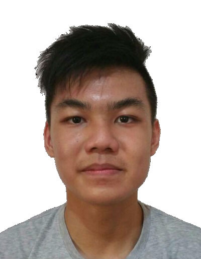
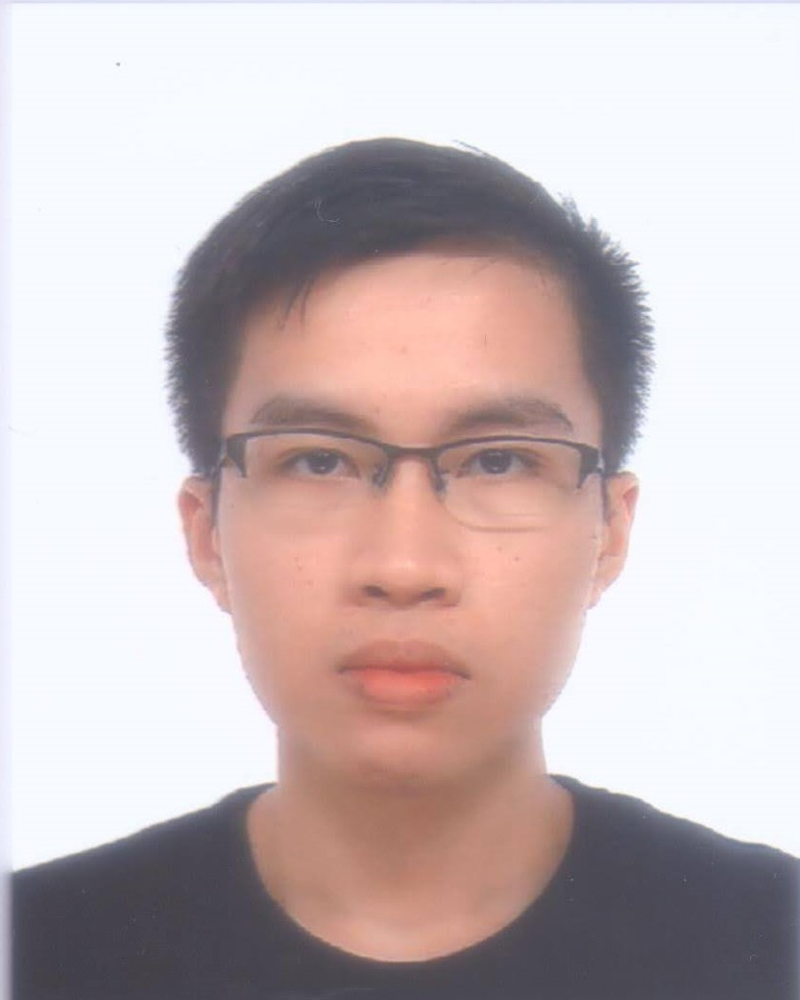
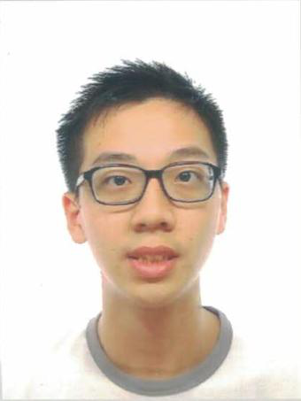

We are a team based in the [School of Computing, National University of Singapore](http://www.comp.nus.edu.sg).

## Project team

### Pang Biao Yi

[[github](http://github.com/schoolex)]
[[portfolio](team/schoolex.md)]

* Role: Developer
* Responsibilities: Documentation

### Tee Kok Siang

[[github](http://github.com/teekoksiang)]
[[portfolio](team/teekoksiang.md)]

* Role: Developer
* Responsibilities: Deliverables and Deadlines

### Lee Yan Cheng

[[github](http://github.com/yanchenglee98)]
[[portfolio](team/yanchenglee98.md)]

* Role: Developer
* Responsibilities: Scheduling, Tracking and Code quality

### Aung Thuya Oo

[[github](http://github.com/athuyaoo)]
[[portfolio](team/athuyaoo.md)]

* Role: Developer
* Responsibilities: Git expert and Integration

### Low Jie Feng

[[github](http://github.com/lowjiefeng1998)]
[[portfolio](team/lowjiefeng1998.md)]

* Role: Developer
* Responsibilities: Testing
