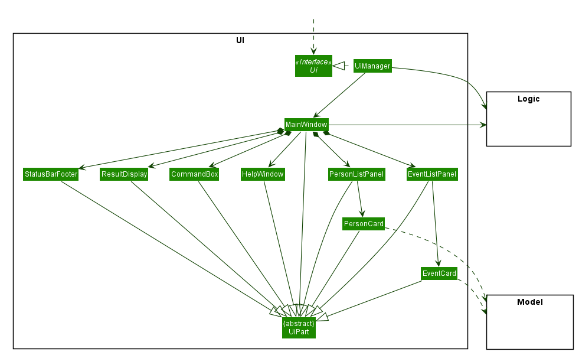
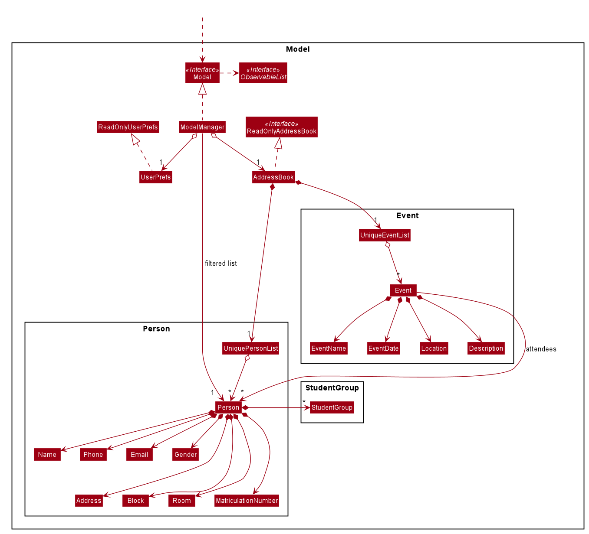
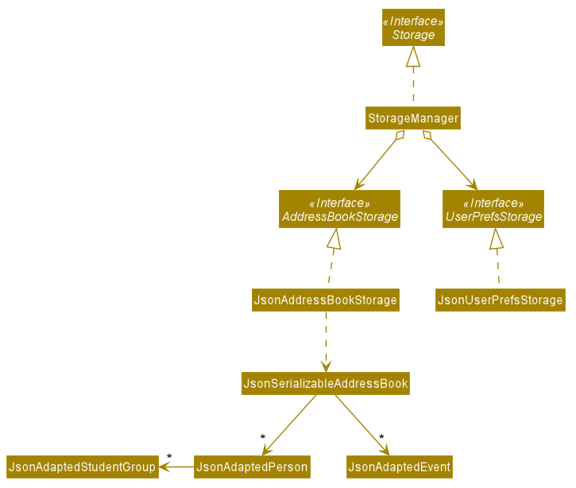
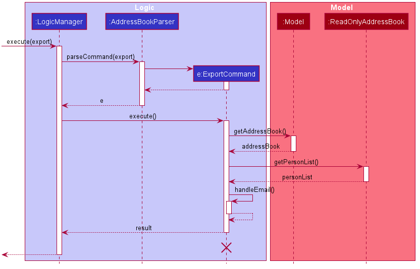
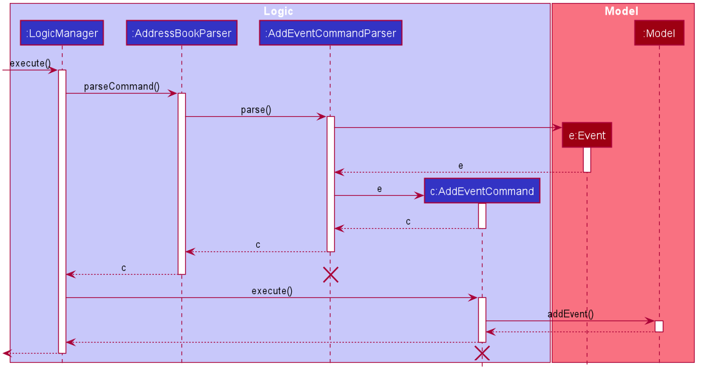
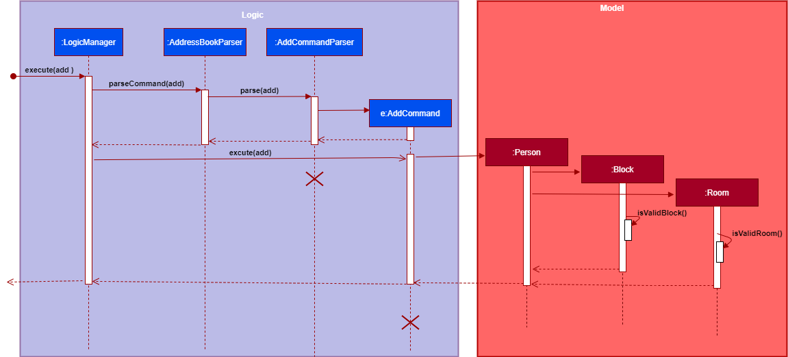
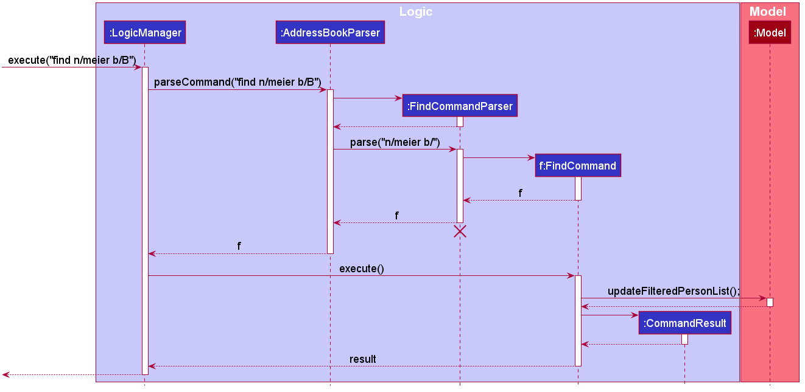
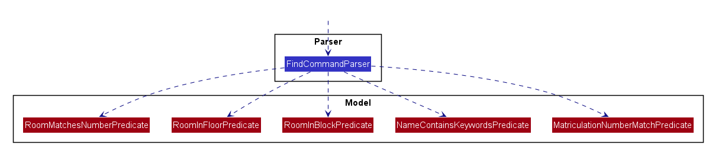
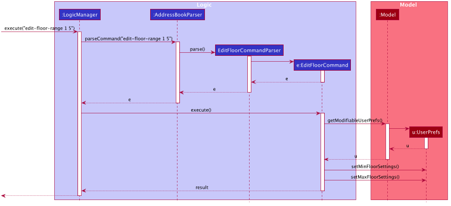

# Hall-y Developer Guide

Version 1.4\
_Updated on 9/11/2020_

Prepared by:  
Aung Thuya Oo  
Lee Yan Cheng  
Low Jie Feng  
Pang Biao Yi  
Tee Kok Siang  

---
* Table of Contents
{:toc}

--------------------------------------------------------------------------------------------------------------------

## **1 Introduction**

### 1.1 Purpose

This document describes the architecture and system design of Hall-y, a hall residents' contact management application.
The goal of this document is to cover the high-level system architecture and design of this application.
The document starts off by describing the high level overview before going into the details of the various components in their respective subsections.

### 1.2 Audience

This document is targeted at developers and designers who wish to do further development on the app.
Software testers can utilize this document to aid them in uncovering bugs during testing.

### 1.3 Development environment

Developers and designers who wish to do further development on the app can refer to the guide [_Setting up and getting started_](SettingUp.md). 
to set up their development environment.

--------------------------------------------------------------------------------------------------------------------

## **2 Design**

:bulb: **Tip:** The `.puml` files used to create diagrams in this document can be found in the [diagrams](https://github.com/AY2021S1-CS2103T-T11-2/tp/tree/master/docs/diagrams) folder. Refer to the [_PlantUML Tutorial_ at se-edu/guides](https://se-education.org/guides/tutorials/plantUml.html) to learn how to create and edit diagrams.

:information_source: **Note:** In any sequence diagram, the lifeline for any object should end at the destroy marker (X) but due to a limitation of PlantUML, the lifeline reaches the end of diagram.

### 2.1 Architecture

The ***Architecture Diagram*** given below explains the high-level design of the App.

Given below is a quick overview of each component.

**`Main`** has two classes called [`Main`](https://github.com/AY2021S1-CS2103T-T11-2/tp/tree/master/src/main/java/seedu/address/Main.java) and [`MainApp`](https://github.com/AY2021S1-CS2103T-T11-2/tp/tree/master/src/main/java/seedu/address/MainApp.java). It is responsible for:

Event           | Description
--------------- | -----------
At app launch   | Initializes the components in the correct sequence, and connects them up with each other.
At shut down    | Shuts down the components and invokes cleanup methods where necessary.

[**`Commons`**](#26-common-classes) represents a collection of classes used by multiple other components.

The rest of the App consists of four components:

Component                            | Description
------------------------------------ | -----------
[**`UI`**](#22-ui-component)            | Builds the UI of the App.
[**`Logic`**](#23-logic-component)      | Executes the different commands.
[**`Model`**](#24-model-component)      | Holds the data of the App in memory.
[**`Storage`**](#25-storage-component)  | Reads data from, and writes data to, the hard disk.

Each of the four components,

* defines its *API* in an `interface` with the same name as the Component.
* exposes its functionality using a concrete `{Component Name}Manager` class (which implements the corresponding API `interface` mentioned in the previous point.

For example, the ***Logic Class Diagram*** given below shows the `Logic` component. It defines its API in the `Logic.java` interface and exposes its functionality using the `LogicManager.java` class which implements the `Logic` interface.

**How the architecture components interact with each other**

The ***Sequence Diagram*** given below shows how the components interact with each other for the scenario where the user issues the command `delete 1`.

The sections below give more details of each component.

### 2.2 UI Component

The ***UI Class Diagram*** given below shows the structure of the `UI` component.

**API** :
[`Ui.java`](https://github.com/AY2021S1-CS2103T-T11-2/tp/tree/master/src/main/java/seedu/address/ui/Ui.java)

The `UI` component builds the UI of the application.

The `UI` component consists of a `MainWindow` that is made up of parts e.g.`CommandBox`, `ResultDisplay`, `PersonListPanel`, `EventListPanel`, `ReferenceSection`, `StatusBarFooter` etc. All these, including the `MainWindow`, inherit from the abstract `UiPart` class.

The `UI` component uses JavaFx UI framework. The layout of these UI parts are defined in matching `.fxml` files that are in the `src/main/resources/view` folder. For example, the layout of the [`MainWindow`](https://github.com/AY2021S1-CS2103T-T11-2/tp/tree/master/src/main/java/seedu/address/ui/MainWindow.java) is specified in [`MainWindow.fxml`](https://github.com/AY2021S1-CS2103T-T11-2/tp/tree/master/src/main/resources/view/MainWindow.fxml).

The `UI` component:

* Executes user commands using the `Logic` component.
* Listens for changes to `Model` data so that the UI can be updated with the modified data.

### 2.3 Logic Component

The ***Logic Class Diagram*** given below shows the structure of the `Logic` component.

**API** :
[`Logic.java`](https://github.com/AY2021S1-CS2103T-T11-2/tp/tree/master/src/main/java/seedu/address/logic/Logic.java)

The `Logic` component executes the different commands.

The `Logic` component consists of `LogicManager`, `Parser`, `Command`, etc. The `Logic` component parses and executes the user command.   

The `Parser` component is defined in `src/main/java/seedu.address/logic/parser` folder. For any command `XYZCommand`, it has a parser called `XYZCommandParser` that inherits from `Parser` and parses the respective `XYZCommand`. 

The `Command` component is defined in `src/main/java/seedu.address/logic/commands` folder. For all `XYZCommand`, it inherits from `Command`. 

The following steps explain the interactions of `Logic` component to parse and execute the user command:

1. `Logic` uses the `AddressBookParser` class to parse the user command.
1. This results in a `Command` object which is executed by the `LogicManager`.
1. The command execution can affect the `Model` (e.g. adding a resident).
1. The result of the command execution is encapsulated as a `CommandResult` object which is passed back to the `Ui`.
1. In addition, the `CommandResult` object can also instruct the `Ui` to perform certain actions, such as displaying help to the user.

The ***Logic Component Sequence Diagram*** given below shows the interactions within the `Logic` component for the `execute("delete 1")` API call.

### 2.4 Model Component

The ***Model Class Diagram*** given below shows the structure of the `Model` component.

**API** : [`Model.java`](https://github.com/AY2021S1-CS2103T-T11-2/tp/tree/master/src/main/java/seedu/address/model/Model.java)

:information_source: **Note:** The `Person` class is used to model a resident.

The `Model` component:

* Stores a `UserPref` object that represents the user’s preferences.
* Stores Hall-y's data.
* Exposes the following unmodifiable lists that can be 'observed' - i.e. the UI can be bound to these lists so that the UI automatically updates when the data in these lists change:
    * `ObservableList<Person>`: list of Hall-y's residents
    * `ObservableList<Event>`: list of Hall-y's events
* Does not depend on any of the other three components.

### 2.5 Storage Component

The ***Storage Class Diagram*** given below shows the structure of the `Storage` component.

**API** : [`Storage.java`](https://github.com/AY2021S1-CS2103T-T11-2/tp/tree/master/src/main/java/seedu/address/storage/Storage.java)

The `Storage` component:
* saves `UserPref` objects in json format and read it back.
* saves Hall-y's data in json format and read it back.

### 2.6 Common Classes

Classes used by multiple components are in the `seedu.address.commons` package.

--------------------------------------------------------------------------------------------------------------------

## **3 Implementation**

This section describes some noteworthy details on how certain features are implemented.

### 3.1 Exporting of information - Lee Yan Cheng

#### 3.1.1 Implementation
The export feature is facilitated by `FileWriter` from Java's IO library.
This feature is used to export emails of the current list of residents displayed. 

The key idea is that we will iterate through the current list and access the relevant information fields.
This operation depends on the size of the current residents list and will be relatively fast.
We will then write the information into a .txt file located at `/data/hally.txt` each separated by a new line. 

Given below is a step-by-step usage scenario of how the `export` feature works:

1. The user launches the application and inputs `export email` into the input box.

2. The `LogicManager#execute()` is then called, and the input is parsed through `AddressBookParser#parseCommand()`, returning an `ExportCommand`.

3. The `export` command then calls `ExportCommand#execute()`, and calls `Model#getAddressBook()` followed by `ReadOnlyAddressBook#getPersonList()` to get the current list of residents.

4. The residents list is then passed to `ExportCommand#handleEmail()` which iterates through the list and calls `Person#getEmail()` to access the `Email` and writes to the file `hally.txt`.

The following sequence diagram shows how the export operation works:

:information_source: <b>Note:</b> 
If the current residents list is empty, an empty hally.txt file will be created.

#### 3.1.2 Design consideration:

##### Aspect: What file format to export to

* **Alternative 1 (current choice)**: Write to a .txt file.
    * Pros
        * More user-friendly.
        * Most operating systems are able to open .txt files.
    * Cons
        * Does not offer much functionality apart from viewing and copying. 

* **Alternative 2 (current choice)**: Write to a .json file
    * Pros
        * More well-known among developers.
    * Cons
        * Less technical users may not know how to open a .json file. 

### 3.2 Adding of events - Low Jie Feng

#### 3.2.1 Implementation
The add event feature is facilitated by the `AddEventCommand`.
It extends `Command` and overrides `Command#execute()` to perform the adding of events.

The key idea is that we will pass the user's input into the `AddressBookParser#parseCommand()`. 
It will create an `Event` with the user's inputs and associate it with `AddEventCommand`.
When `AddEventCommand#execute()` is called, the associated `Event` is passed into the `Model` component.
The `Model` component then saves the `Event`.

Given below is a step-by-step usage scenario and how the add event feature works:
1. The user launches the application and inputs `add-event n/Hall Dinner dt/01/01/2020 18:00 l/Dining Hall d/Dinner@Dining Hall` into the input box.
2. The `UI` component accepts the input and passes it to `LogicManager#execute()`.
3. The input is parsed through `AddressBookParser#parseCommand()`, returning an `AddEventCommand` with an `Event` class associated to it.
4. The `LogicManager` class then calls `AddEventCommand#execute()`, which uses `Model#addEvent()` to save the associated `Event` class.

The following sequence diagram shows how the add event operation works:

#### 3.2.2 Design consideration:

##### Aspect: When to create the new `Event` class

* **Alternative 1 (current choice)**: Create the new `Event` in `AddressBookParser#parseCommand()`
    * Pros
        * Early conversion of user's input into `Event` class.
        * Consistent with the existing code base.
    * Cons
        * Increases dependency between `Logic` and `Model` component.

* **Alternative 2**: Create the new `Event` in `AddEventCommand#execute()`
    * Pros
        * Decreases dependency between `Logic` and `Model` component.
    * Cons
        * Late conversion of user's input into `Event` class.

We decided to use **Alternative 1** as it is simpler.

For **Alternative 2**, we found it to be too complex. The user's input has to be passed across the different components.
By converting it to an `Event` class early, we can work at a higher level of abstraction.
Other methods do not have to worry about string's format, and can focus on handling it as an `Event` class.

### 3.3 Persistent block and room settings - Pang Biao Yi

#### 3.3.1 Implementation
This feature is implemented by making use of a json file to store the blocks and rooms info of the Hall. It does this by defining all available block and rooms in an editable json file. 

A predefined configuration with the following settings will be set as default:

Blocks : A, B, C, D  
Rooms : 100 - 420

Blocks are represented as a single alphabet in uppercase. Rooms are represented as <Level><Room number>.
The default settings specifies that the hall will have 4 blocks, A, B, C and D. There are 4 levels with 20 rooms per level.  
Advanced users can edit the json file directly to change these settings

Given below is a step-by-step usage scenario of how this feature will ensure that there are no invalid inputs for the block and room field:

1. The user launches the application and tries to add a new user by typing  
`add n/NAME p/PHONE_NUMBER e/EMAIL a/ADDRESS br/ROOM_NUMBER g/GENDER m/MATRICULATION_NUMBER [s/STUDENT_GROUP...]` into the input box.

2. The `LogicManager#execute()` is then called, and the input is parsed through `AddressBookParser#parseCommand()`, returning an `AddCommand`.

3. The `AddCommand` then calls `AddCommand#execute()`, and passes all the arguments to the `Person` constructor.

4. The `Person` constructor proceeds to create a new `Person` object with all the fields, 2 of which are `Block` and `Room`.

5. The `Block` and `Room` calls `Block#isValidBlock()` and `Room#isValidRoom()` respectively to parse the json file and compares the input arguments with the information specified in the json file. 

6. A new `Block` and `Room` is returned if the input arguments matches the info specified in the json file. Otherwise, an exception is thrown and the result box will inform the user of the invalid input.

The following sequence diagram shows how this feature works:

#### 3.3.2 Design consideration:

##### Aspect: Method of modifying the json file

* **Alternative 1 (current choice)**: Editing it directly
    * Pros
        * Easier to implement.
    * Cons
        * Less technical users may not know how to edit the file correctly. 

* **Alternative 2**: Adding a command to support the editing of block room settings with dynamic updates to the block room reference section
    * Pros
        * All users will be able to edit the file safely without restarting the app
    * Cons
        * Time-consuming to implement.

### 3.4 Listing all student groups - Tee Kok Siang

#### 3.4.1 Implementation
The listing all student groups feature is facilitated by `ListGroupCommand`. It extends `Command` and overrides `Command#execute()` to list all student groups.

The key idea is that we will iterate through the resident list and store the resident's student groups in a `Set` to avoid storing duplicate student groups. We will then output the student groups' name in the result box.

Given below is a step-by-step usage scenario and how the listing all student groups feature works:

1. The user launches the application and types `list-group` into the input box.
2. The `UI` handles the input and calls `LogicManager#execute()` to execute it.
3. The `AddressBookParser#parseCommand()` is called to parse the input and returns a `ListGroupCommand`.
4. The `ListGroupCommand` calls `ListGroupCommand#execute()` which retrieves the list of all residents by calling `Model#getFilteredPersonList()`.
5. The `ListGroupCommand#execute()` iterates through the list of all residents and then gets a set of all residents' student groups.
6. The `ListGroupCommand#execute()` iterates through the set of all student groups and formats it to a `String` result.     
7. The `UI` displays the result in the result box.

The following sequence diagram shows how the listing all student groups operation works:
  

:information_source: <b>Note:</b> 
If there is no resident or student group, an empty list will be displayed.

### 3.5 Finding Students - Aung Thuya Oo

#### 3.5.1 Implementation
The finding of students based on their characteristics is facilitated by the `FindCommand`.
It extends `Command` and overrides `Command#execute()` to find students.

The high-level idea is that the user input from the `FindCommand` will be passed into the 
`AddressBookParser#parseCommand()`. Based on user input, it will form a list of predicates
that will return true if a resident matches the given inputs.

Given below is a step-by-step usage scenario and how the finding of students works:

1. The user launches the application and types `find n/meier b/B` into the input box.
2. The `UI` handles the input and calls `LogicManager#execute()` to execute it.
3. The `AddressBookParser#parseCommand()` is called to parse the input, which calls `FindCommandParser#parseCommand()`,
subsequently returning a `FindCommand` with the associated list of predicates.
4. The `FindCommand` calls `FindCommand#execute()` which forms a predicate that fulfill every predicate from the list.
5. The predicate updates the filtered list of all residents by calling `Model#updateFilteredPersonList()`.
The resulting filtered list matches this predicate, which means that it matches all predicates in the original list.
7. The `UI` displays the result in the result box.

The following sequence diagram shows how finding students works:

`FindCommandParser` uses these predicates during `parseCommand()` to form the list of predicates in `FindCommand` as shown below: 

#### 3.5.2 Design consideration:

##### Aspect: When to convert list of predicates to a single predicate

* **Alternative 1**: Create the predicate during `AddressBookParser#parseCommand()`
    * Pros
        * Memory is being freed earlier as list of predicates is being converted immediately.
    * Cons
        * Makes testing of equal find commands more difficult.

* **Alternative 2 (current choice)**: Create the predicate during `FindCommand#execute()`
    * Pros
        *  It is easier to compare equality for `FindCommand` objects.
        *  It is easier to test.
    * Cons
        * More memory is needed to store the list of predicates for longer periods of time.

We decided to use **Alternative 2** as it increases testability by making it simpler to test.

For **Alternative 1**, it is difficult to compare 2 predicates as they have been merged together. 
With **Alternative 2**, it is easier to compare each equality of each element in the list of predicates instead to check whether the `FindCommand` objects are equal. 
As testing is important to ensuring that programs run correctly, we decided to use alternative 2.

### 3.6 Editing Floor settings - Tee Kok Siang

#### 3.6.1 Implementation
The editing floor settings feature is facilitated by `EditFloorCommand`. It extends `Command` and overrides `Command#execute()` to edit floor settings.

The key idea is that we will pass the user’s input into the `AddressBookParser#parseCommand()`. It will then call `EditFloorCommandParser#parse()` to create an `EditFloorCommand` with the user’s inputs. When `EditFloorCommand#execute()` is called, it will set the floor settings through `UserPrefs`. The floor settings changes will take effect after restarting Hall-y.

Given below is a step-by-step usage scenario and how the editing floor settings feature works:

1. The user launches the application and types `edit-floor-range 1 5` into the input box.
2. The `UI` handles the input and calls `LogicManager#execute()` to execute it.
3. The `AddressBookParser#parseCommand()` is called to parse the input.
4. The `EditFloorCommandParser#parse()` is then called to parse the input and returns a `EditFloorCommand`.
5. The `EditFloorCommand` calls `EditFloorCommand#execute()` to do a validation check to ensure `minFloorSettings` and `maxFloorSettings` are valid.
6. After the validation check, the `EditFloorCommand#execute()` calls `UserPrefs#setMinFloorSettings()` and `UserPrefs#setMaxFloorSettings` to set the floor settings.   
7. The `UI` displays the edited floor settings in the result box.
8. The floor settings changes will take effect after restarting Hall-y.

The following sequence diagram shows how the editing floor settings operation works:
  

#### 3.6.2 Design consideration:

#### Aspect: When to update Hall-y of the floor settings changes

* **Alternative 1 (current choice)**: Update Hall-y of the floor settings change after restarting it
    * Pros
        * Able to revert the settings changes before it takes effect. 
    * Cons
        * Require to restart Hall-y to see the settings changes.

* **Alternative 2**: Update Hall-y of the floor settings change immediately
    * Pros
        * Able to see the settings changes immediately. 
    * Cons
        * Possible to erase all of Hall-y data (including residents and events) if accidentally typing in the wrong values. 
 
We decided to use **Alternative 1** as it provides additional safety measures to prevent erasing all of Hall-y data.

For **Alternative 2**, the risk of erasing Hall-y data is relatively higher because the settings changes will take effect immediately. With **Alternative 1**, it is safer because the settings changes will only take effect after restarting Hall-y. The user can confirm the settings changes before it takes effect.

--------------------------------------------------------------------------------------------------------------------

## **4 Documentation**

Developers and designers who wish to understand how Hall-y is currently documented can refer to the [_Documentation guide_](Documentation.md).

--------------------------------------------------------------------------------------------------------------------

## **5 Logging**

Hall-y utilises logging to keep track of the users' activity. Developers and designers who wish to understand how logging works in Hall-y can refer to the [_Logging guide_](Logging.md).

--------------------------------------------------------------------------------------------------------------------

## **6 Testing**

Developers and designers who wish to do further testing on Hall-y's features can refer to the [_Testing guide_](Testing.md).

--------------------------------------------------------------------------------------------------------------------

## **7 Configuration**

Certain properties of Hall-y can be modified. Developers and designers who wish to learn more can refer to the [_Configuration guide_](Configuration.md).

--------------------------------------------------------------------------------------------------------------------

## **8 DevOps**

Hall-y can be built and released automatically. Developers and designers who wish to learn more can refer to the [_DevOps guide_](DevOps.md).

--------------------------------------------------------------------------------------------------------------------

## **Appendix A: Product Scope**

**Target user profile**:

* has a need to manage a significant number of hall residents
* prefer desktop apps over other types
* can type fast
* prefers typing to mouse interactions
* is reasonably comfortable using CLI apps

**Value proposition**: manage all hall residents' records in a single desktop CLI-based app.

## **Appendix B: User Stories**

Priorities: High (must have) - `* * *`, Medium (nice to have) - `* *`, Low (unlikely to have) - `*`

| Priority | As a …​                                    | I want to …​                     | So that I can…​                                                        |
| -------- | ------------------------------------------ | ------------------------------ | ---------------------------------------------------------------------- |
| `* * *`  | Hall admin managing residents       | Create residents' record        | I can keep track of the residents' record                 |
| `* * *`  | Hall admin managing residents       | Delete residents' record               | I can have updated residents' record                                            |
| `* * *`  | Hall admin managing residents       | View residents who are residing in the specific block  | I can keep track of the residents related to the specific block                  |
| `* * *`  | Hall admin general                  | Export a list of emails          | I can email the correct group of students |
| `* * *`  | Hall admin managing rooms           | Keep a record of who is residing in which rooms   | Quickly find out who is in which room                |
| `* * *`  | Hall admin managing student groups  | Keep track of student group member counts within the hall   | So that i can find out which student group’s are high in demand                |
| `* * *`  | Hall admin managing student groups  | Keep track of student groups within the hall   | So that I can find what student groups there are in the hall                |
| `* * *`  | Hall admin managing hall events     | Quickly filter out students involved in certain events   | I can email selected group of students easily                |
| `* * *`  | Hall admin managing hall events     | Create hall events  | I can contact the residents about the events                |
| `* * *`  | Hall admin managing hall events     | Update hall events   | I can update the event's details                |
| `* * *`  | Hall admin general                  | Export email, based on filters  | I can send this data to people who will want information on these residents                |
| `* *`  | Hall admin managing hall events     | Quickly find out who attended compulsory events   | I can email selected group of students easily                |
| `* *`  | Hall admin managing hall events     | Delete hall events   | I can remove events that were cancelled                |
| `* *`  | Hall admin general     | Can change the block and room settings   | to cater to different halls               |
| `*`  | Hall admin managing rooms           | Keep a record of rooms that need maintenance   | Schedule rooms for maintenance and have maintenance records                |
| `*`  | Hall admin managing student groups  | Keep track of the student group points accumulated by residents   | I know who can continue staying next semester                |
| `*`  | Hall admin managing student groups  | Find who has which role in student group   | To find out which students are exco of the student group                |
| `*`  | Hall admin managing sports          | Find out whether our teams won IHG   | So that I know which athletes is good                |
| `*`  | Hall admin managing hall events     | Archive hall events   | I can archive past events                |
| `*`  | Hall admin managing hall events     | Query past hall events based on period   | So that I can do a recap of hall events                |
| `*`  | Hall admin managing discipline      | Query for a student's demerit points and all rules broken   | I can expel them next sem                |
| `*`  | Hall admin managing discipline      | Query most commonly broken rules   | I can work to prevent those cases                |
| `*`  | Hall admin managing discipline      | Create rule lists for demerit points   | To create and include new rules such as covid temp measures                |
| `*`  | Hall admin managing discipline      | Award demerit points to a student records   | Punish students                |
| `*`  | Hall admin managing discipline      | Select a rule that was broken when awarding demerit points   | To correctly allocate the demerit point for the student commiting the offence                |
| `*`  | Hall admin managing discipline      | Give additional details, e.g. who, what, when, how, where   | I know why they received the demerit points in the first place                |
| `*`  | Hall admin managing discipline      | Delete demerit points from students' records   | Undo any mistakes that occurred when giving them demerit points               |
| `*`  | Hall admin managing discipline      | Reset demerit points for all students   | -                |
| `*`  | Hall admin managing discipline      | Keep track of the budget left for the block events   | I can plan the event according to the budget                |

## **Appendix C: Use Cases**

(For all use cases below, the **System** is the `Hall-y` and the **Actor** is the `hall admin`, unless specified otherwise)

**Use case: UC01 - List residents**

**MSS**
1.  User requests to list residents
2.  Hall-y shows a list of residents\
Use case ends

**Use case: UC02 - Add a resident**

**MSS**
1.  User enters resident's details
2.  Hall-y adds resident into list
3.  Hall-y <ins>displays list (UC01)</ins>\
Use case ends.

**Extensions**

* 1a. User enters details in the wrong format.
    * 1a1. Hall-y shows an error message and correct format.\
  Use case ends.
  
  
**Use case: UC03 - Delete a resident**

**MSS**

1.  User requests to <ins>list residents (UC01)</ins>
2.  User requests to delete a specific resident in the list
3.  Hall-y deletes the resident\
    Use case ends.

**Extensions**

* 1a. The list is empty.\
Use case ends.

* 2a. The given index is invalid.
    * 2a1. Hall-y shows an error message.\
    Use case resumes at step 2.

**Use case: UC04 - Edit a resident**

**MSS**

1.  User requests to <ins>list residents (UC01) </ins>
2.  User requests to edit a specific resident in the list
3.  Hall-y edits resident in the list
4.  Hall-y <ins>displays list (UC01) </ins>\
Use case ends.

**Extensions**

* 1a. The list is empty.\
Use case ends.

* 2a. The given index is invalid.
    * 2a1. Hall-y shows an error message.\
      Use case ends.
      
* 2b. User enters details in the wrong format.
    * 2b1. Hall-y shows an error message and correct format.\
    Use case ends.
    
 
**Use case: UC05 - List student groups**

**MSS**
1.  User requests to list student groups
2.  Hall-y shows a list of student groups\
Use case ends  

**Use case: UC06 - Listing of events**

**MSS**
1.  User requests to list events
2.  Hall-y shows a list of events\
Use case ends

**Use case: UC07 - Add an event**

**MSS**

1.  User enters event's details
2.  Hall-y adds event into list
3.  Hall-y <ins>displays events list (UC06)</ins>\
Use case ends.

**Extensions**

* 1a. User enters details in the wrong format.
    * 1a1. Hall-y shows an error message and correct format.\
      Use case ends.

**Use case: UC08 - Delete an event**

**MSS**

1.  Hall-y <ins>displays events list (UC06)</ins>
2.  User requests to delete a specific event in the list
3.  Hall-y deletes the event\
    Use case ends.

**Extensions**

* 2a. The given index is invalid.

    * 2a1. Hall-y shows an error message.\
      Use case ends.

**Use case: UC09 - Edit an event**

**MSS**

1.  User requests to edit a specific event in the list
2.  Hall-y edits event in the list
3.  Hall-y <ins>displays events list (UC06) </ins>\
Use case ends.

**Extensions**

* 1a. The given index is invalid.

    * 1a1. Hall-y shows an error message.\
      Use case ends.

* 1b. User enters details in the wrong format.
    * 1b1. Hall-y shows an error message and correct format.\
      Use case ends.

**Use case: UC10 - Assign a resident to an event** 

Preconditions: Resident and event lists are populated.

**MSS**

1.  User assigns resident to event
2.  Hall-y adds resident into event
3.  Hall-y updates the event with the newly added resident\
Use case ends.

**Extensions**

* 1a. User assigns duplicate resident to the event.
    * 1a1. Hall-y shows an error message.\
      Use case ends.

**Use case: UC11 - List event attendees** 

Preconditions: Event exists.

**MSS**

1.  User request to list event attendees
2.  Hall-y displays list of event attendees \
Use case ends.

**Use case: UC12 - Clear event attendees** 

Preconditions: Event exists.

**MSS**

1.  User request to clear event attendees
2.  Hall-y clears list of event attendees
3.  Hall-y displays the updated event\
Use case ends.

**Use case: UC13 - Export email**

**MSS**

1.  User requests to <ins>list contacts (UC01)</ins>
2.  User requests to export emails
3.  Hall-y exports the list of email to a .txt file\
Use case ends.
    
**Use case: UC14 - Modify block room settings file directly**

**MSS**

1.  User exits Hall-y
2.  User opens up the `preferences.json` file 
3.  User modifies the block and room settings
4.  User launch Hall-y
5.  Hall-y shows the updated settings\
Use case ends.

**Extensions**

* 3a. The block and room settings are invalid
    * 3a1. Hall-y reset the block and room settings to default\
Use case ends.  

**Use case: UC15 - Edit block settings**

**MSS**

1.  User request to edit block settings
2.  User enters the new block settings 
3.  User restarts Hall-y
4.  Hall-y shows the updated block settings\   
Use case ends.

**Extensions**

- 2a. The block settings are invalid
    - 2a1. Hall-y shows invalid block settings error message\
      Use case ends.
      
**Use case: UC16 - Edit floor settings**

**MSS**

1.  User request to edit floor settings
2.  User enters the new floor settings 
3.  User restarts Hall-y
4.  Hall-y shows the updated floor settings\
Use case ends.

**Extensions**

- 2a. The floor settings are invalid
    - 2a1. Hall-y shows invalid floor settings error message\
Use case ends.
      
**Use case: UC17 - Edit room settings**

**MSS**

1.  User request to edit room settings
2.  User enters the new room settings 
3.  User restarts Hall-y
4.  Hall-y shows the updated room settings\
Use case ends.

**Extensions**

- 2a. The room settings are invalid
    - 2a1. Hall-y shows invalid room settings error message\
    Use case ends.

## **Appendix D: Non-Functional Requirements**

1.  Should work on any _mainstream OS_ as long as it has Java `11` or above installed.
2.  Should be able to hold up to 1000 residents without a noticeable sluggishness in performance for typical usage.
3.  A user with above average typing speed for regular English text (i.e. not code, not system admin commands) should be able to accomplish most of the tasks faster using commands than using the mouse.
4.  The application should work without internet.
5.  Data should be stored in a human editable text file.
6.  Should be for a single-user
7.  JAR file should be less than 100Mb.

## **Appendix E: Glossary**

* **Mainstream OS**: Windows, Linux, Unix, MacOS
* **Matriculation number**: Unique Identification for NUS students, which they will obtain when they matriculate into NUS

--------------------------------------------------------------------------------------------------------------------

## **Appendix F: Instructions For Manual Testing**

Given below are instructions to test the app manually.

:information_source: <b>Note:</b> These instructions only provide a starting point for testers to work on;
testers are expected to do more *exploratory* testing.

### F.1 Launch and shutdown

1. Initial launch

   1. Test case: Download the jar file and copy into an empty folder. Then, double-click the jar file. 
   Expected: Shows the GUI with a set of sample residents. The window size may not be optimum.

1. Saving window preferences

   1. Test case: Resize the window to an optimum size. Move the window to a different location. Close the window. Then, re-launch the app by double-clicking the jar file. 
       Expected: The most recent window size and location is retained.

### F.2 Adding a resident

1. Add a resident with missing parameter

    1. Test case: `add n/John Doe` 
    Expected: No resident is added. Error details shown in the status message.
    
    
2. Adding duplicate resident
    1. Prerequisites: A resident with the same matriculation number `A0123456B` already exists.
    
    2. Test case: `add n/John Doe p/98765432 e/johnd@example.com a/311, Clementi Ave 2, #02-25 g/M br/A420 m/A0123456B s/basketball s/hackers` 
    Expected: No resident is added. Error details shown in the status message.

### F.3 Editing a resident

1. Edit a resident with duplicate phone number, email address, matriculation number or room number

    1. Prerequisites: A resident with the same matriculation number `A0123456B` already exists.
    
    2. Prerequisites: A resident that is to be edited already exists.
    
    2. Test case: `edit 1 m/A0123456B`  
    Expected: Resident is not edited. Error details shown in the status message.

### F.4 Deleting a resident

1. Delete a resident while all residents are being shown

   1. Prerequisites: List all residents using the `list` command. Multiple residents in the list.

   1. Test case: `delete 1` 
      Expected: First resident is deleted from the list. Details of the deleted resident shown in the status message.

   1. Test case: `delete 0` 
      Expected: No resident is deleted. Error details shown in the status message.

   1. Other incorrect delete commands to try: `delete`, `delete x`, `...` (where x is larger than the list size) 
      Expected: Similar to previous.

### F.5 Adding an event

1. Add an event with valid parameters

    1. Test case: `add-event n/Seminar dt/30/01/2020 15:00 l/Dining Hall d/A regular seminar` 
    Expected: The events list will be updated to reflect the newly added event called Seminar

1. Add an event with invalid parameters

    1. Test case: `add-event n/Seminar@Hall dt/30/01/2020 15:00 l/Dining Hall d/A regular seminar` 
    Expected: No event will be added. The result box will indicate that event names cannot contain symbols.
    
    1. Test case: `add-event n/Seminar dt/30-01-2020 15:00 l/Dining Hall d/A regular seminar` 
    Expected: No event will be added. The result box will indicate that event dates need to be of the format DD/MM/YYYY HH:mm.
    
    1. Test case: `add-event n/Seminar dt/30/01/2020 15:00 l/Dining Hall/Hall d/A regular seminar` 
    Expected: No event will be added. The result box will indicate that event locations cannot contain symbols.

### F.6 Editing an event

1. Edit with valid parameters
    
    1. Prerequisites: There is an event with event index 1 called Hall Lunch.
    
    1. Test case: `edit-event 1 n/Hall Dinner` 
    Expected: The event list will change the 1st event to be called Hall Dinner instead. The result box will show the details of the edited event.
    
    1. Test case: `edit-event X` 
    Expected: No event is edited. The events list remain unchanged. The error message is shown in the result box.
    
### F.7 Deleting an event

1. Delete an event

    1. Prerequisites: There is an event with event index 1
    
    1. Test case: `delete-event 1` 
    Expected: The first event is deleted. Details of the event are shown in the result box.

### F.8 Assigning a resident

1. Assign a new resident
   1. Prerequisites: Resident 1 is not assigned to event 1. 

   2. Test case: `assign 1 1` 
      Expected: Resident 1 is assigned to event 1 and is reflected on the UI.

2. Assigning a duplicate resident 
   1. Prerequisites: Resident 1 is already assign to event 1. 

   2. Test case: `assign 1 1` 
      Expected: An result box notifies the user that the resident has already been added.
      
### F.9 Listing of event attendees

1. Listing an event attendees
   1. Prerequisites: Event 1 exists. 

   2. Test case: `list-event-attendees 1` 
      Expected: Residents list is updated with the residents attending event 1
      
### F.10 Clearing of event attendees

1. Clearing an event attendees
   1. Prerequisites: Event 1 exists and is populated with residents. 

   2. Test case: `clear-event-attendees 1` 
      Expected: Event 1 attendees is removed and reflected on the UI.

### F.11 Finding residents

1. Find a resident who has particular characteristics
    
    1. Test case: `find f/3` 
    Expected: The residents list will be updated with all residents who stay on the third floor
    
    1. Test case: `find f/5` 
    Expected: The residents list does not change. An error message is shown. 

### F.12 Editing block settings

1. Edit the block settings 

    1. Test case: `edit-block-range A E`  
    Expected: After restarting Hall-y, the blocks list will be updated to reflect the block settings changes
        
    2. Test case: `edit-block-range a E`  
    Expected: The result box will indicate that block letter can only be a capital letter. 

    3. Test case: `edit-block-range A e`  
    Expected: The result box will indicate that block letter can only be a capital letter. 

### F.13 Editing floor settings

1. Edit the floor settings 

    1. Test case: `edit-floor-range 1 5`  
    Expected: After restarting Hall-y, the blocks list will be updated to reflect the floor settings changes
        
    2. Test case: `edit-floor-range 0 5`  
    Expected: The result box will indicate that floor number can only from 1 to 9.

    3. Test case: `edit-floor-range 1 10`  
    Expected: The result box will indicate that floor number can only from 1 to 9.

### F.14 Editing room settings

1. Edit the room settings 

    1. Test case: `edit-room-range 1 10`  
    Expected: After restarting Hall-y, the blocks list will be updated to reflect the room settings changes
        
    2. Test case: `edit-room-range 0 10`  
    Expected: The result box will indicate that room number can only from 1 to 99.

    3. Test case: `edit-room-range 1 100`  
    Expected: The result box will indicate that room number can only from 1 to 99.
    
### F.15 Saving data

1. Deal with missing/corrupted data files

   1. Test case: Delete the file  
   Expected: Hall-y will reset to the default details.
   
   2. Test case: Corrupt the file  
   Expected: Hall-y will reset and an empty list will be presented.

