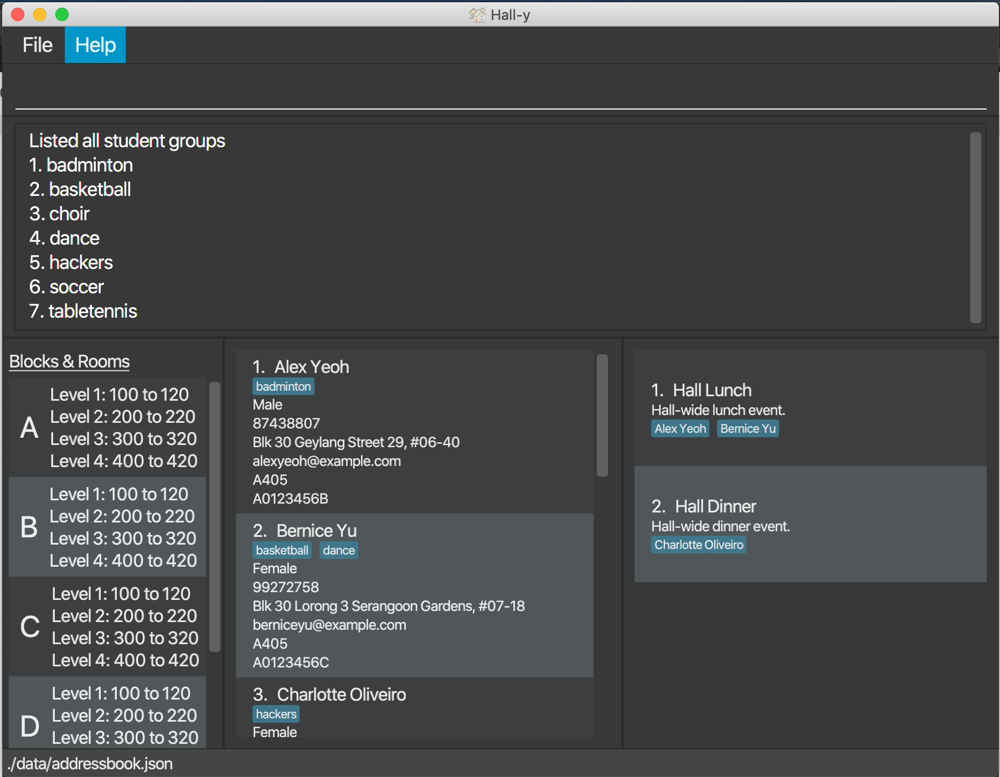

Hall-y is a **desktop app for managing hall residents, optimized for use via a Command Line Interface** (CLI) while still having the benefits of a Graphical User Interface (GUI). If you can type fast, Hall-y will allow you to add, edit, view, and delete hall residents' records faster than traditional GUI apps.

* Table of Contents
{:toc}

--------------------------------------------------------------------------------------------------------------------

## 3 About This Document

The following table explains the formatting used in this guide and its definition.

Format | Definition, Examples
--------|------------------
`code` | Represent a command or part of a command.   e.g. `add n/John Doe p/98765432 e/johnd@example.com a/John street, block 123, #01-01 br/A104 g/M m/A0199242X`
UPPER_CASE | Represent a parameter to be supplied by the user.   e.g. `n/NAME` can be used as `n/John Doe`
[item] | Represent an optional parameter to be supplied by the user.   e.g. `n/NAME [p/PHONE_NUMBER]` can be used as `n/John Doe p/91234567` or as `n/John Doe`

--------------------------------------------------------------------------------------------------------------------

## 1 Features

**:information_source: Notes about the command format:** 

* Words in `UPPER_CASE` are the parameters to be supplied by the user. 
  e.g. in `add n/NAME`, `NAME` is a parameter which can be used as `add n/John Doe`.

* Items in square brackets are optional. 
  e.g `n/NAME [p/PHONE_NUMBER]` can be used as `n/John Doe p/91234567` or as `n/John Doe`.

* Parameters can be in any order. 
  e.g. if the command specifies `n/NAME p/PHONE_NUMBER`, `p/PHONE_NUMBER n/NAME` is also acceptable.

### 1.1 Viewing help: `help`

Shows a message explaining how to access the help page.

Format: `help`

### 1.2 Adding a resident: `add`

Adds a resident to Hall-y.

Format: `add n/NAME p/PHONE_NUMBER e/EMAIL a/ADDRESS r/ROOM_NUMBER g/GENDER m/MATRICULATION_NUMBER`

* ROOM_NUMBER is in the format \<Block\>\<Room Number\>, e.g. B505, C201, etc
* GENDER: either M for male or F for female

Examples:

*   `add n/John Doe p/98765432 e/johnd@example.com a/John street, block 123, #01-01 r/A104 g/M m/A0199242X`
*   `add n/Mary Dill p/98236802 e/marryd@example.com a/Jane street, block 29, #02-01 r/B205 g/F m/A0192352T`

### 1.3 Listing all residents: `list`

Shows a list of all residents registered in Hall-y.

Format: `list`

### 1.4 Editing a resident: `edit`

Edits an existing resident in Hall-y.

Format: `edit INDEX [n/NAME] [p/PHONE_NUMBER] [e/EMAIL] [a/ADDRESS] [r/ROOM_NUMBER] [g/GENDER] [m/MATRICULATION_NUMBER]…​`

* Edits the resident at the specified `INDEX`. The index refers to the index number shown in the displayed resident list. The index **must be a positive integer** 1, 2, 3, …​
* At least one of the optional fields must be provided.
* Existing values will be updated to the input values.

Examples:
*  `edit 1 p/91234567 e/johndoe@example.com r/B402` Edits the phone number, email address and room number of the 1st resident to be 91234567, johndoe@example.com and B402 respectively.
*  `edit 2 n/Betsy Crower p/87652103` Edits the name of the 2nd resident and phone number to be `Betsy Crower` and 87652103 respectively.

### 1.5 Locating residents by name: `find`

Finds residents whose names contain any of the given keywords.

Format: `find KEYWORD [MORE_KEYWORDS]`

* The search is case-insensitive. e.g `hans` will match `Hans`
* The order of the keywords does not matter. e.g. `Hans Bo` will match `Bo Hans`
* Only the name is searched.
* Only full words will be matched e.g. `Han` will not match `Hans`
* Residents matching at least one keyword will be returned (i.e. `OR` search).
  e.g. `Hans Bo` will return `Hans Gruber`, `Bo Yang`

Examples:
* `find John` returns `john` and `John Doe`
* `find alex david` returns `Alex Yeoh`, `David Li` 
  

### 1.6 Deleting a resident: `delete`

Deletes the specified resident from Hall-y.

Format: `delete INDEX`

* Deletes the resident at the specified `INDEX`.
* The index refers to the index number shown in the displayed resident list.
* The index **must be a positive integer** 1, 2, 3, …​

Examples:
* `list` followed by `delete 2` deletes the 2nd resident in Hall-y.
* `find Betsy` followed by `delete 1` deletes the 1st resident in the results of the `find` command.

### 1.7 Clearing all entries: `clear`

Clears all entries from Hall-y.

Format: `clear`

### 1.8 Exiting the program: `exit`

Exits the program.

Format: `exit`

### 1.9 Saving the data

Hall-y's data is saved in the hard disk automatically after any command that changes the data. There is no need to save manually.

### 1.10 Exporting of email: `export`

Exports the email address of all entries in Hall-y as a .txt file.

Format: `export`

### 6.14 Listing all student groups: `list-group`

You can list all student groups by using the `list-group` command.

The steps for this command are as follows:
1. Enter the list group command by typing `list-group` into the input box
2. Press enter
3. The result box will display all the student groups: 

--------------------------------------------------------------------------------------------------------------------

## 2 FAQ

**Q**: How do I transfer my data to another Computer? 
**A**: Install the app in the other computer and overwrite the empty data file it creates with the file that contains the data of your previous Hall-y home folder.

--------------------------------------------------------------------------------------------------------------------

## 3 Command summary

Action | Format, Examples
--------|------------------
**Add** | `add n/NAME p/PHONE_NUMBER e/EMAIL a/ADDRESS r/ROOM_NUMBER g/GENDER m/MATRICULATION_NUMBER`   e.g., `add n/John Doe p/98765432 e/johnd@example.com a/John street, block 123, #01-01 r/A104 g/M m/A0199242X`
**Clear** | `clear`
**Delete** | `delete INDEX`  e.g., `delete 3`
**Edit** | `edit INDEX [n/NAME] [p/PHONE_NUMBER] [e/EMAIL] [a/ADDRESS] [r/ROOM_NUMBER] [g/GENDER] [m/MATRICULATION_NUMBER]…​​`  e.g.,`edit 2 n/James Lee e/jameslee@example.com r/A210`
**Find** | `find KEYWORD [MORE_KEYWORDS]`  e.g., `find James Jake`
**List** | `list`
**Help** | `help`
**Export** | `export`

--------------------------------------------------------------------------------------------------------------------

## Appendix A: Glossary

* **Command Line Interface (CLI)**: Text interface to interact with the application by typing the command
* **Graphical User Interface (GUI)**: Visual interface to interact with the application
* **Hall admin**: An administrative staff to handle hall-related matters
* **Matriculation number**: Unique identification for NUS students, which they will obtain when they matriculate into NUS 
* **Student group**: An interest group for the hall residents to conduct extracurricular activities