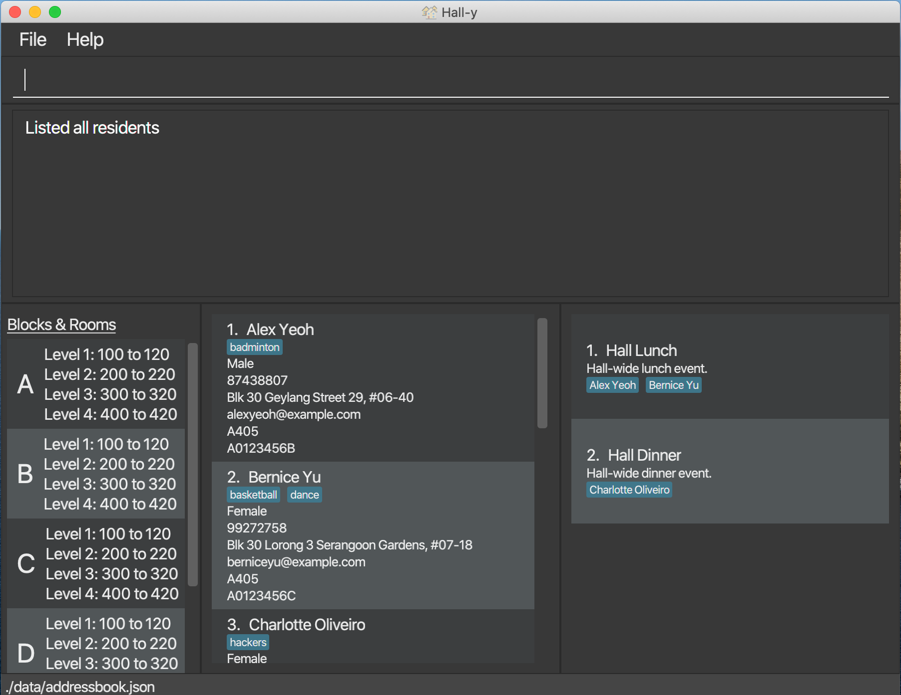

**Hall-y is a desktop application for managing your hall residents.**
It features a Command Line Interface (CLI), which means you operate Hall-y by typing in various commands.
It also features a Graphical User Interface (GUI), meaning you can easily view your hall residents and events, with their respective details.

* If you are interested in using Hall-y, head over to the [_Quick Start_ section of the **User Guide**](UserGuide.html#3-getting-started).
* If you are interested about developing Hall-y, the [**Developer Guide**](DeveloperGuide.html) is a good place to start.

**Acknowledgements**

* Libraries used: [JavaFX](https://openjfx.io/), [Jackson](https://github.com/FasterXML/jackson), [JUnit5](https://github.com/junit-team/junit5)
